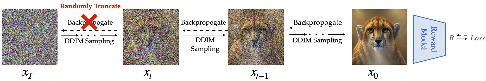

<div align="center">

<!-- TITLE -->
# **Aligning Text-to-Image Diffusion Models with Reward Backpropagation**


[](https://arxiv.org/abs/2310.03739)
[](http://align-prop.github.io)
</div>

This is the official implementation of our paper [Aligning Text-to-Image Diffusion Models with Reward Backpropagation](https://arxiv.org/abs/2310.03739) by Mihir Prabhudesai, Anirudh Goyal, Deepak Pathak, and Katerina Fragkiadaki.


<!-- DESCRIPTION -->
## Abstract
Text-to-image diffusion models have recently emerged at the forefront of image generation, powered by very large-scale unsupervised or weakly supervised text-to-image training datasets.  Due to the weakly supervised   training,  controlling  their behavior in downstream tasks, such as maximizing human-perceived image quality,  image-text alignment, or ethical image generation, is difficult. Recent works finetune diffusion models to downstream reward functions using vanilla reinforcement learning, notorious for the high variance of the gradient estimators. In this paper, we propose AlignProp, a method that aligns diffusion models to downstream reward functions using end-to-end backpropagation of the reward gradient through the denoising process. While naive implementation of such backpropagation would require prohibitive memory resources for storing the partial derivatives of modern text-to-image models, AlignProp finetunes low-rank adapter weight modules and uses gradient checkpointing, to render its memory usage viable. We test AlignProp in finetuning diffusion models to various objectives, such as image-text semantic alignment, aesthetics, compressibility and controllability of the number of objects present, as well as their combinations.  We show AlignProp  achieves higher rewards in fewer training steps than alternatives, while being conceptually simpler, making it a straightforward choice for optimizing diffusion models for differentiable reward functions of interest.

## Code

### Installation 
Create a conda environment with the following command:
```bash
conda create -n alignprop python=3.10
conda activate alignprop
pip install -r requirements.txt
```
Please use accelerate==0.17.0, other library dependancies might be flexible.

### Training Code

Accelerate will automatically handle multi-GPU setting. 
The code can work on a single GPU, as we automatically handle gradient accumulation as per the available GPUs in the CUDA_VISIBLE_DEVICES environment variable.
For our experiments, we used 4 A100s- 40GB RAM to run our code. If you are using a GPU with a smaller RAM, please edit the [per_gpu_capacity](https://github.com/mihirp1998/DiffAlign/blob/ac0ae6afddad15187bc65727cb151d43cc822ea7/config/align_prop.py#L161) variable accordingly. Further if u are bottlenecked by GPU memory, consider using AlignProp with K=1, this will significantly reduce the memroy usage. 

#### Aesthetic Reward model.
Currently we early stop the code to prevent overfitting, however feel free to play with the `num_epochs` variable as per your needs.

```bash
accelerate launch main.py --config config/align_prop.py:aesthetic
```

If you are memory bottlenecked use AlignProp K=1, feel free to vary `trunc_backprop_timestep` as per ur memory avaibility, use the following command. Lower values of `trunc_backprop_timestep` (higher values of K) can help with focusing on more semantic details:


```bash
accelerate launch main.py --config config/align_prop.py:aesthetic_k1
```

#### HPSv2 Reward model.

```bash
accelerate launch main.py --config config/align_prop.py:hps
```

If you are memory bottlenecked use AlignProp K=1, feel free to vary `trunc_backprop_timestep` as per ur memory avaibility, use the following command. Lower values of `trunc_backprop_timestep` (higher values of K) can help with focusing on more semantic details:


```bash
accelerate launch main.py --config config/align_prop.py:hps_k1
```

### Evaluation & Checkpoints
Please find the checkpoints for Aesthetic reward function [here](https://drive.google.com/file/d/1r7291awe3z37drfKyxLyqcNq6dHl6Egf/view?usp=sharing) and Hps-v2 reward function [here](https://drive.google.com/file/d/1nvSxwxf-OnDrKq4ob-j5islfUSif8lQb/view?usp=sharing)

Evaluates the model checkpoint, as per the `resume_from` variable in the config file.  Evaluation includes calculating the reward and storing/uploading the images to local/wandb.

#### normal evaluation.

```bash
accelerate launch main.py --config config/align_prop.py:evaluate
```
#### with mixing.
Update the `resume_from` and `resume_from_2` varaibles to mention the checkpoints to mix. Set `resume_from_2` to `stablediffusion` to interpolate between `resume_from` and Stable diffusion weights.  The coefficient of mixing is based on the variable `mixing_coef_1` which can be edited in the config file.

```bash
accelerate launch main.py --config config/align_prop.py:evaluate_soup
```

### Acknowledgement

Our codebase is directly built on top of [DDPO](https://github.com/kvablack/ddpo-pytorch). 
We would like to thank Kevin Black and team, for opensourcing their code.

## Citation

If you find this work useful in your research, please cite:

```bibtex
@misc{prabhudesai2023aligning,
      title={Aligning Text-to-Image Diffusion Models with Reward Backpropagation}, 
      author={Mihir Prabhudesai and Anirudh Goyal and Deepak Pathak and Katerina Fragkiadaki},
      year={2023},
      eprint={2310.03739},
      archivePrefix={arXiv},
      primaryClass={cs.CV}
}
```
